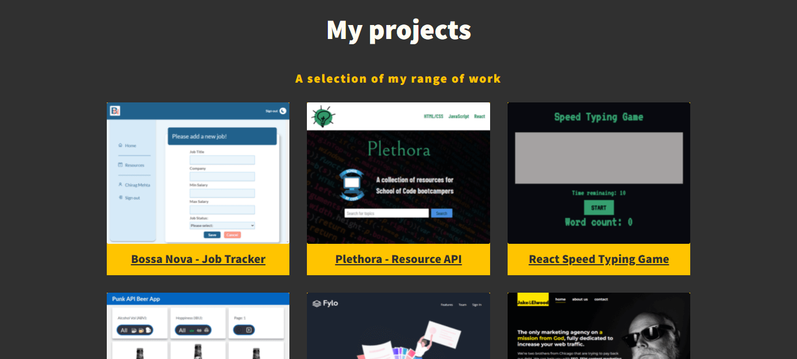

# Chirag Mehta - portfolio website

[Link to live deploy](https://chirag-designs.netlify.app/)

This is my portfolio website which I created while following a tutorial from [Kevin Powell](https://www.kevinpowell.co/) on [Scrimba](https://scrimba.com/). I have recently graduated from the [School of Code](https://www.schoolofcode.co.uk/) and am in the process of redesigning this site using Gatsby and Tailwind CSS. My most recent School of Code projects are listed on the site.

## Table of contents

- [Running Locally](#running-locally)
- [Description](#description)
  - [Challenges](#challenges)
  - [Future Plans](#future-plans)
- [Overview](#overview)
  - [My Goals](#my-goals)
  - [Screenshot](#screenshot)
- [My Process](#my-process)
  - [Built with](#built-with)
  - [What I learned](#what-i-learned)
- [Author](#author)

## Running Locally

Since this site is made with HTML, CSS and JavaScript it doesn't require any setup or installing NPM modules. Simply clone or fork the repo onto your local machine and open the index.html file using your web browser. It looks great in Chrome, Firefox and Safari!

## Description

My portfolio describes my skills, experience and highlights a selection of projects I've created. I used HTML, CSS and Vanilla JavaScript to create this because I wanted to get a solid grounding in these fundamental web development languages.

### Challenges

- Styling the intro section with my photo on larger screens. Had to learn negative positioning to create the effect I designed
- Creating a full screen menu which has offset positioning and slides over the page smoothly
- Having the six project cards resize and react responsively on different screens

### Future Plans

- Plan to recreate this entire site using Gatsby and Tailwind to continue developing as a Front End Developer
- Gatsby has in-built routing so the portfolio will become a single-page site and easier to maintain and update
- Migrating to Gatsby and Tailwind will dramatically improve the site's performance and SEO ranking 
- Use React Testing Library fo unit and integration tests and Cypress for end-to-end tests

## Overview

### My goals

Users should be able to:

- View the optimal layout for each of the website's pages depending on their device's screen size
- See hover states for all interactive elements on the page
- View each page and be able to toggle between the tabs to see new information

### Screenshot

## My process

### Built with

- Semantic HTML5 markup
- CSS custom properties
- Flexbox
- CSS Grid
- Mobile-first workflow

### What I learned

The main thing I learned by building my portfolio was how to make wireframe designs come to life using animations and optimising features for different screen sizes. For instance I have the hamburger and full screen menu which slides over the screen on mobile screens. The layout reverts to a more traditional nav menu at larger screen sizes because that's what users expect contributes to better UX.

## Author

- LinkedIn - [@chiragmehtauk](https://www.linkedin.com/in/chiragmehtauk/)
- Twitter - [@chirag_uk](https://twitter.com/chirag_uk)